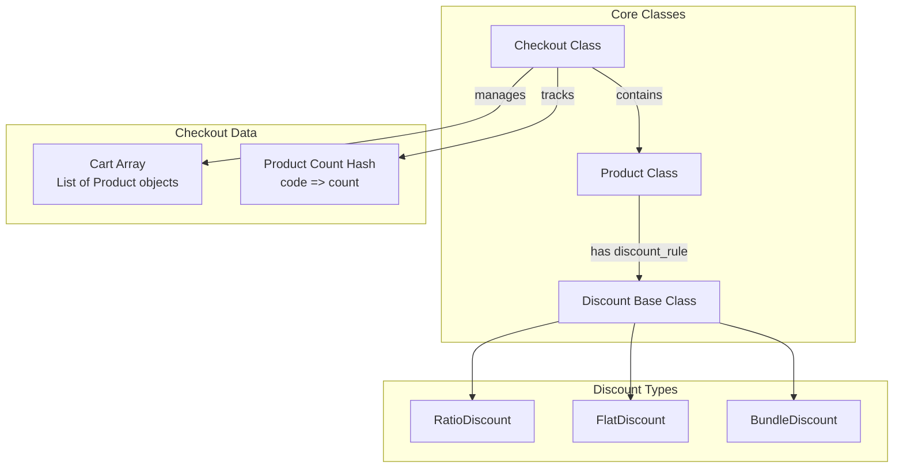
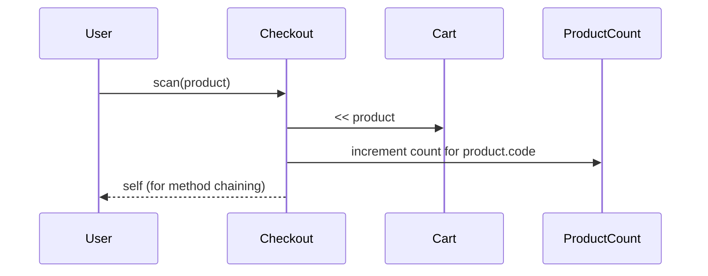
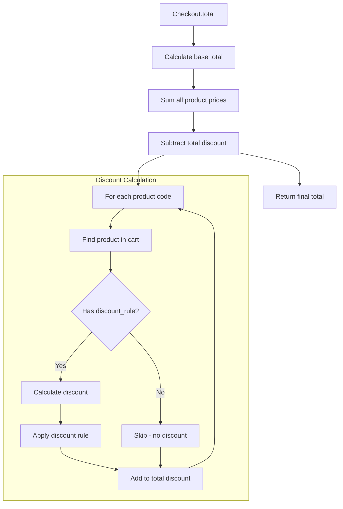
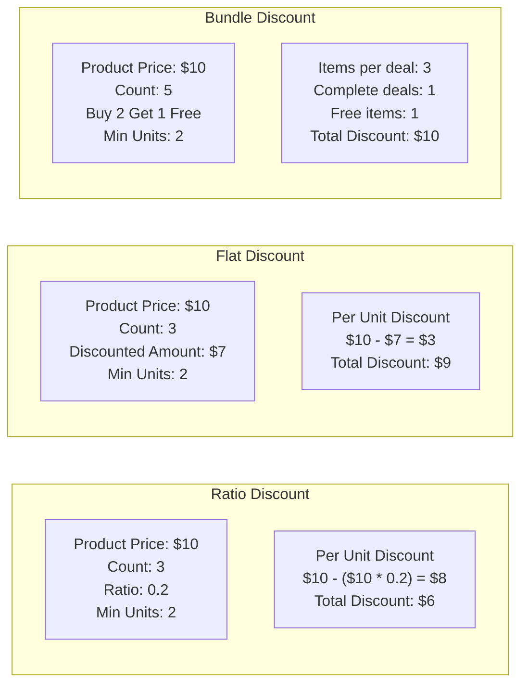
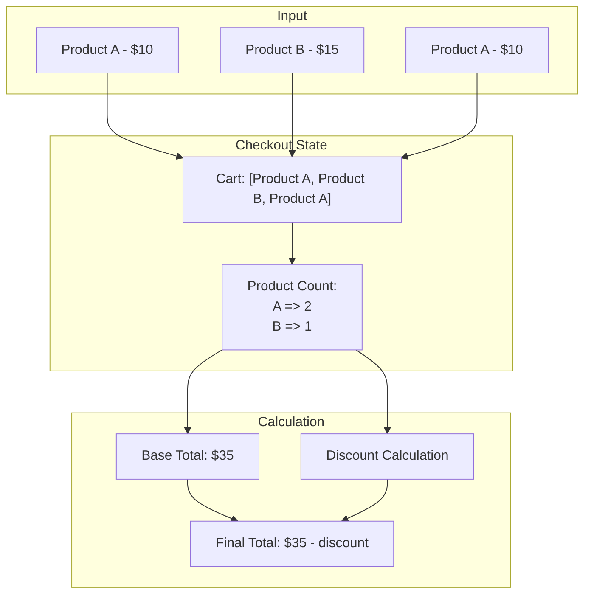

# Cash Register Checkout System - Scan and Total Flow

## System Architecture Diagram

## Scan Process Flow

## Total Calculation Flow

## Discount Calculation Examples

## Data Flow Diagram

## Key Methods Summary

| Method | Purpose | Returns |
|--------|---------|---------|
| `scan(product)` | Add product to cart and increment count | `self` (for chaining) |
| `total` | Calculate final price with discounts | `Float` (rounded to 2 decimals) |
| `discount` | Calculate total discount across all products | `Float` |
| `calculate_discount_for(product)` | Calculate discount for specific product | `Float` |

## Discount Rules

1. **Ratio Discount**: Reduces price by percentage (e.g., 20% off)
2. **Flat Discount**: Reduces price by fixed amount (e.g., $3 off)
3. **Bundle Discount**: Buy X get Y free (e.g., Buy 2 Get 1 Free)

All discounts require a minimum number of units to activate. 